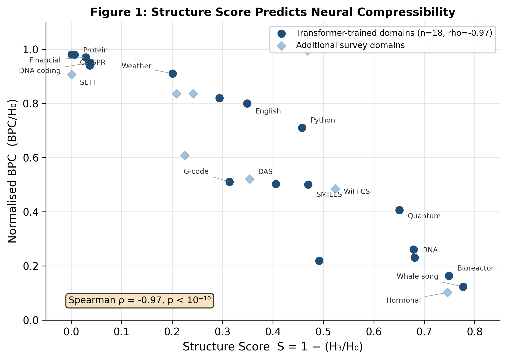

# Narrow-Band Senses

Code and data for **"Narrow-Band Senses: An Information-Theoretic Framework for Multimodal AI Perception"** by Daniel Ziekenoppasser-Powell.

## Key Result

Character-level Shannon entropy statistics predict neural compressibility across 30 domains with Spearman rho = -0.97 (p < 10^-10, n = 18), providing a practical screening tool for multimodal AI development.



## Repository Structure

```
entropy/           Core entropy computation pipeline
  entropy.py       H0, H2, H3, structure score, MI decay, shuffled baseline

experiment/code/   Character-level transformer (GPT-2 style)
  model.py         CharTransformer architecture (XS/S/M/L)
  dataset.py       CharDataset with SEP token masking
  train.py         Training loop with early stopping
  evaluate.py      BPC evaluation
  config.py        Model configs, domain lists, hyperparameters

survey/            30-domain entropy survey
  scripts/         Per-domain entropy analysis scripts
  results/         Entropy measurement results (JSON)

figures/           Paper figures
```

## Quick Start

### Compute entropy for a text file

```python
from entropy.entropy import (
    compute_ngram_counts, compute_entropy_miller_madow,
    compute_conditional_entropy, compute_structure_score
)

with open('your_data.txt') as f:
    text = f.read()

counts1 = compute_ngram_counts(text, 1)
h0 = compute_entropy_miller_madow(counts1)
h3 = compute_conditional_entropy(text, 3)
structure_score = 1 - (h3 / h0)

print(f'H0 = {h0:.3f} bits, H3 = {h3:.3f} bits')
print(f'Structure score = {structure_score:.3f}')
```

### Train a transformer on a domain

```python
from experiment.code.train import train_one_run

result = train_one_run(
    domain='english',
    model_size='S',
    seed=42,
    context_len=512,
    data_dir='path/to/data',
    output_dir='path/to/results',
    device='cuda'
)

print(f'Test BPC: {result["test_bpc"]:.4f}')
```

## 30-Domain Survey Results

| Domain | Structure Score | Classification |
|---|---|---|
| ATC radar | 0.900 | Notation-transparent |
| Dolphin whistles | 0.882 | Notation-transparent |
| Whale song | 0.777 | Notation-transparent |
| Bioreactor | 0.749 | Notation-transparent |
| Hormonal cycle | 0.746 | Notation-transparent |
| RNA secondary | 0.681 | Notation-transparent |
| WiFi CSI | 0.524 | Proxy sensor |
| SMILES | 0.470 | Notation-transparent |
| DAS seismic | 0.354 | Proxy sensor |
| English text | 0.349 | Notation-transparent |
| Protein | 0.007 | Notation-opaque |
| SETI | 0.001 | Notation-opaque |

(Full results for all 30 domains in `survey/results/`)

## Requirements

- Python 3.10+
- PyTorch 2.0+
- NumPy

## Citation

```bibtex
@article{ziekenoppasser-powell2026nbs,
  title={Narrow-Band Senses: An Information-Theoretic Framework for Multimodal AI Perception},
  author={Ziekenoppasser-Powell, Daniel},
  year={2026},
  note={Preprint}
}
```

## License

MIT License. See [LICENSE](LICENSE).
